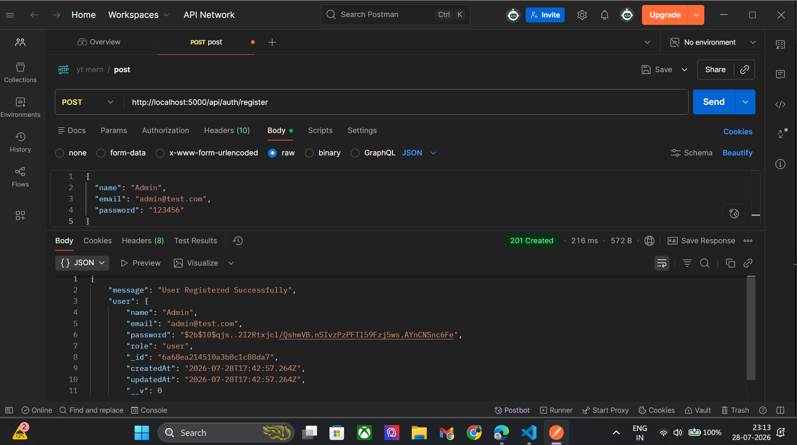
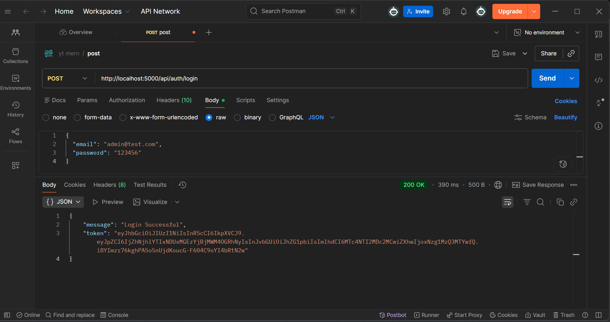
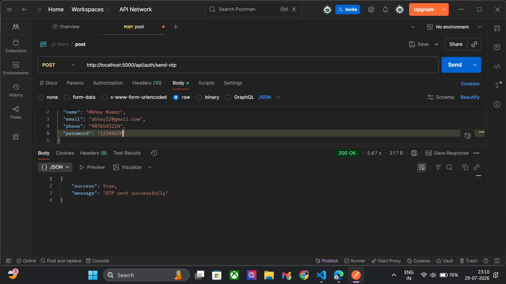
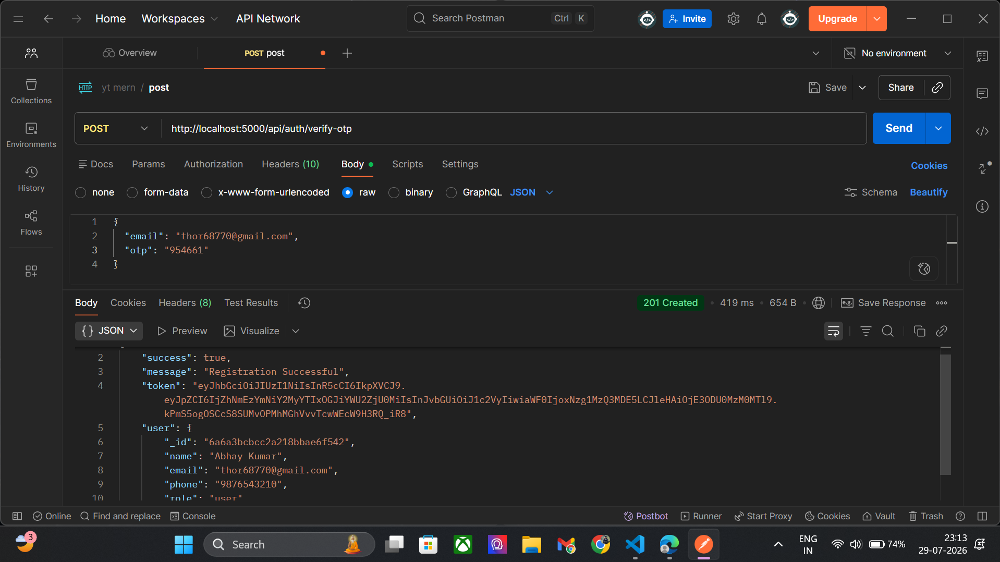
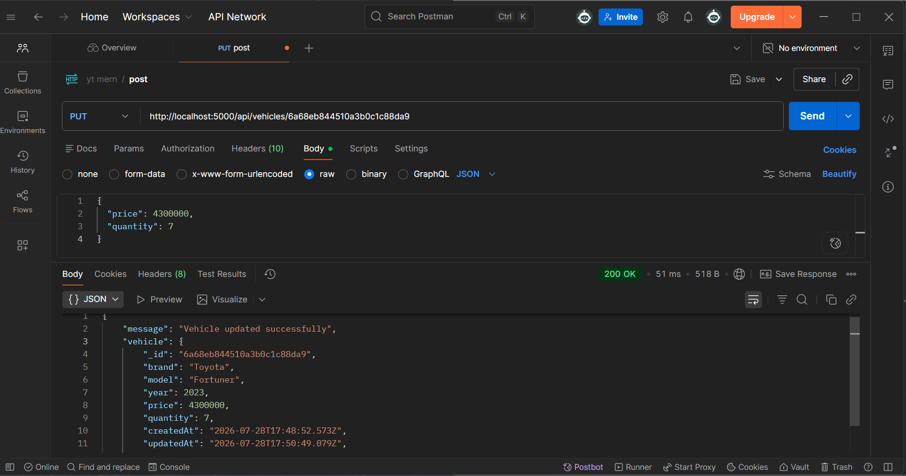
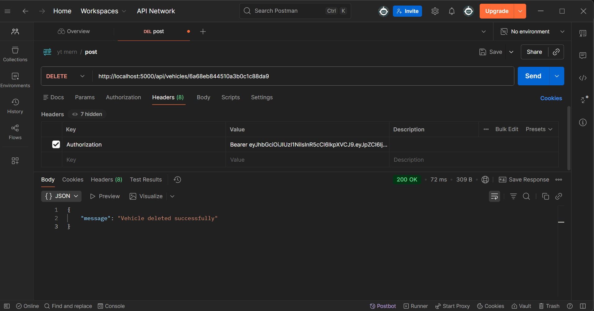

<div align="center">

# 🚗 DriveHub
### Car Dealership Inventory System

A modern full-stack **Car Dealership Inventory Management System** built with the **MERN Stack**.

[](https://react.dev/)
[](https://nodejs.org/)
[](https://expressjs.com/)
[](https://www.mongodb.com/)
[](https://jwt.io/)
[](https://tailwindcss.com/)

## 🌐 Live Demo

### Frontend
**Vercel:** https://drivehub-inventory-system.vercel.app/

### Backend
**Railway:** https://drivehub-inventory-system-production.up.railway.app/

---

## 🔑 Demo Accounts

### 👨‍💼 Admin Account

| Field | Value |
|-------|-------|
| Email | `abhayyadav96312@gmail.com` |
| Password | `Abhay@9631` |

---

### 👤 User Account 1

| Field | Value |
|-------|-------|
| Email | `abhaykumaryadav748864@gmail.com` |
| Password | `Abhay@7488` |

---

### 👤 User Account 2

| Field | Value |
|-------|-------|
| Email | `cec234043.it.cec@cgc.edu.in` |
| Password | `Abhay@7488` |

---

## 📝 Registration & Email Verification

> **Note**
>
> This project is hosted on **Railway Free Tier**. The application uses **Nodemailer + Gmail SMTP** for OTP email verification.
>
> Railway **Free**, **Trial**, and **Hobby** plans block outbound SMTP connections. Therefore, OTP emails cannot be sent from the deployed application.
>
> To fully enable email verification in production, the backend must be deployed on a **Railway Pro** plan or another hosting provider that allows outbound SMTP connections.
>
> **For evaluation purposes, please use one of the demo accounts provided above.**

</div>

---

# 📖 Project Overview

DriveHub is a full-stack **Car Dealership Inventory System** that enables dealerships to efficiently manage vehicle inventory while providing customers with a seamless experience for browsing and purchasing vehicles.

The application includes secure **JWT-based authentication**, **Role-Based Access Control (RBAC)**, **vehicle inventory management**, **purchase history tracking**, **OTP-based email verification**, **vehicle image uploads**, and an **AI-powered assistant** to enhance the user experience.

Administrators can securely add, update, delete, and restock vehicles, while customers can search inventory, purchase vehicles, and view their purchase history through a responsive React-based user interface.

This project was developed as part of the **TDD Kata: Car Dealership Inventory System** assignment and demonstrates full-stack development, RESTful API design, database integration, automated testing, clean software architecture, and responsible AI-assisted software development.

---

# 🎯 Assignment Requirements Covered

This project implements all major requirements specified in the assignment.

| Requirement | Status |
|-------------|:------:|
| 🔐 User Registration & Login | ✅ |
| 🔑 JWT Authentication | ✅ |
| 🚘 Vehicle CRUD Operations | ✅ |
| 🔍 Vehicle Search & Filtering | ✅ |
| 🛒 Vehicle Purchase | ✅ |
| 📦 Vehicle Restock (Admin) | ✅ |
| 👨‍💼 Role-Based Access Control | ✅ |
| 📜 Purchase History | ✅ |
| 🖼️ Vehicle Image Upload | ✅ |
| 📱 Responsive React SPA | ✅ |
| 🧪 Backend Automated Testing | ✅ |
| 🤖 AI Usage Documentation | ✅ |
| 📄 PROMPTS.md Included | ✅ |
| 📚 Comprehensive README | ✅ |
| ☁️ Live Deployment | ✅ 


# ✨ Features

## 🔐 Authentication & Authorization

- User Registration with Email OTP Verification
- Secure Login using JWT Authentication
- Persistent User Sessions
- Role-Based Access Control (Admin & User)
- Protected API Routes
- Secure Password Hashing using bcrypt

---

## 🚘 Vehicle Inventory Management

### 👨‍💼 Admin

- Add New Vehicles
- Update Vehicle Details
- Delete Vehicles
- Restock Vehicle Inventory
- Upload Vehicle Images using Cloudinary
- Manage Complete Inventory

### 👤 User

- Browse Available Vehicles
- View Vehicle Details
- Search Vehicles by Brand
- Purchase Vehicles
- View Personal Purchase History

---

## 📦 Inventory Management

- Real-time Inventory Updates
- Automatic Stock Reduction After Purchase
- Prevent Purchases for Out-of-Stock Vehicles
- Quantity-based Purchase Support
- Admin Inventory Restocking

---

## 🔍 Search & Filtering

- Search Vehicles by Brand
- Responsive Search Experience
- Instant Vehicle Listing Updates

---

## 📜 Purchase Management

- Purchase History Tracking
- Admin Access to All Purchase Records
- User Access to Personal Purchase History
- Transaction Date & Quantity Tracking

---

## 🤖 AI Features

- AI-powered Vehicle Assistant
- Groq API Integration
- Interactive Chat Interface

---

## 📧 Email Features

- OTP Email Verification
- Professional HTML Email Templates
- Secure Registration Verification

---

## 🎨 User Experience

- Modern Responsive UI
- Mobile-Friendly Design
- Protected Routes
- Toast Notifications
- Loading Indicators
- Clean Dashboard Interface

|# 🛠️ Tech Stack

| Category | Technologies |
|----------|--------------|
| **Frontend** | React.js, Tailwind CSS, React Router DOM, Axios, React Hot Toast, Lucide React |
| **Backend** | Node.js, Express.js |
| **Database** | MongoDB, Mongoose |
| **Authentication** | JWT (JSON Web Tokens), bcrypt |
| **Email Service** | Nodemailer, Gmail SMTP |
| **Image Storage** | Cloudinary, Multer |
| **AI Integration** | Groq API |
| **Testing** | Jest, Supertest, MongoDB Memory Server |
| **Deployment** | Vercel (Frontend), MongoDB Atlas |
| **Version Control** | Git, GitHub |

---

## 🏗️ System Architecture

```text
┌──────────────────────────────┐
│         React Frontend       │
│     (Tailwind CSS SPA)       │
└──────────────┬───────────────┘
               │ REST API
               ▼
┌──────────────────────────────┐
│      Express.js Backend      │
│ JWT • RBAC • Controllers     │
└──────────────┬───────────────┘
       │              │
       ▼              ▼
 MongoDB Atlas    External Services
                  • Cloudinary
                  • Nodemailer
                  • Groq AI
```

# 📂 Project Structure

```text
drivehub-inventory-system
│
├── backend
│   ├── config
│   ├── controllers
│   ├── middleware
│   ├── models
│   ├── routes
│   ├── services
│   ├── tests
│   ├── utils
│   ├── app.js
│   ├── server.js
│   ├── package.json
│   └── .env
│
├── frontend
│   ├── public
│   ├── src
│   │   ├── assets
│   │   ├── components
│   │   ├── context
│   │   ├── pages
│   │   ├── services
│   │   ├── utils
│   │   ├── App.jsx
│   │   └── main.jsx
│   ├── package.json
│   └── vite.config.js
│
├── screenshots
├── README.md
├── PROMPTS.md
└── .gitignore
```
# 🚀 Getting Started

Follow the steps below to run the project locally.

## 📋 Prerequisites

Make sure the following software is installed on your system:

- Node.js (v18 or later)
- npm
- Git
- MongoDB Atlas account (or a local MongoDB instance)
- Cloudinary account
- Gmail account with an App Password (for OTP emails)
- Groq API Key

---

## 1️⃣ Clone the Repository

```bash
git clone https://github.com/abhay963/drivehub-inventory-system.git

cd drivehub-inventory-system
```

---

## 2️⃣ Backend Setup

Navigate to the backend folder.

```bash
cd backend
```

Install dependencies.

```bash
npm install
```

Create a `.env` file inside the `backend` directory.

Example:

```env
PORT=5000

MONGO_URI=your_mongodb_connection_string

JWT_SECRET=your_jwt_secret

EMAIL_USER=your_email@gmail.com
EMAIL_PASS=your_gmail_app_password

CLOUDINARY_CLOUD_NAME=your_cloud_name
CLOUDINARY_API_KEY=your_api_key
CLOUDINARY_API_SECRET=your_api_secret

GROQ_API_KEY=your_groq_api_key
```

Start the backend server.

```bash
npm run dev
```

The backend will start on:

```
http://localhost:5000
```

---

## 3️⃣ Frontend Setup

Open a new terminal.

```bash
cd frontend
```

Install dependencies.

```bash
npm install
```

Create a `.env` file inside the `frontend` directory.

Example:

```env
VITE_API_URL=http://localhost:5000/api
```

Start the frontend.

```bash
npm run dev
```

The frontend will start on:

```
http://localhost:5173
```

---

## 4️⃣ Running the Application

After starting both servers:

- Open your browser.
- Visit:

```
http://localhost:5173
```

You can now:

- Register a new account
- Verify your email using the OTP
- Log in securely
- Browse available vehicles
- Search vehicles
- Purchase vehicles
- View purchase history
- Access the Admin Dashboard (Admin users)

# 📡 REST API Documentation

The backend exposes a RESTful API for authentication, vehicle management, inventory operations, and purchase history.

## 🔐 Authentication

| Method | Endpoint | Description | Access |
|--------|----------|-------------|--------|
| POST | `/api/auth/register` | Register a new user | Public |
| POST | `/api/auth/verify-otp` | Verify email using OTP | Public |
| POST | `/api/auth/login` | Login and receive JWT token | Public |

---

## 🚗 Vehicle Management

| Method | Endpoint | Description | Access |
|--------|----------|-------------|--------|
| GET | `/api/vehicles` | Get all available vehicles | Public |
| GET | `/api/vehicles/search` | Search vehicles by brand | Public |
| POST | `/api/vehicles` | Add a new vehicle | Admin |
| PUT | `/api/vehicles/:id` | Update vehicle details | Admin |
| DELETE | `/api/vehicles/:id` | Delete a vehicle | Admin |

---

## 📦 Inventory Management

| Method | Endpoint | Description | Access |
|--------|----------|-------------|--------|
| POST | `/api/vehicles/:id/purchase` | Purchase a vehicle | Authenticated User |
| POST | `/api/vehicles/:id/restock` | Restock vehicle inventory | Admin |

---

## 🛒 Purchase History

| Method | Endpoint | Description | Access |
|--------|----------|-------------|--------|
| GET | `/api/purchase/history` | View purchase history | Authenticated User / Admin |

---

## 🤖 AI Chat

| Method | Endpoint | Description | Access |
|--------|----------|-------------|--------|
| POST | `/api/chat` | AI-powered vehicle assistant | Authenticated User |


# 📸 Application Screenshots

The following screenshots showcase the major features and functionality of the DriveHub application.

---

## 🏠 Landing Page

The landing page introduces DriveHub with a modern and responsive interface.


---

## 🚀 Landing Page (Features)

Highlights the key features and services offered by the platform.


---

## 📝 User Registration

New users can create an account securely.


---

## ✅ Registration Validation

Form validation and error handling during registration.


---

## 📧 Email OTP Verification

OTP verification to activate newly registered accounts.


---

## 🔐 User Login

Secure authentication using JWT.


---

## 👨‍💼 Admin Dashboard

Overview of inventory, sales, and management features.


---

## 📊 Dashboard Analytics

Visual charts displaying dealership statistics.


---

## 📈 Sales Analytics

Additional charts showing inventory and sales insights.


---

## 🚗 Vehicle Inventory Management

Admin interface for managing dealership inventory.


---

## ➕ Add New Vehicle

Form for adding vehicles to the inventory.


---

## 📦 Restock Vehicle Inventory

Increase available stock for existing vehicles.


---

## 💰 Sales Management

View completed vehicle purchases and sales records.


---

## 📋 Sales Details

Detailed sales and purchase information.


---

## 👤 User Dashboard

Customer dashboard displaying available vehicles.


---

## 🚘 Vehicle Listing

Browse and explore available vehicles.


---

## 👤 User Profile

Manage personal account information.


---

## 🤖 Chat Assistant

Integrated chat interface.


---

## 🧠 AI Vehicle Assistant

Groq-powered AI assistant for answering vehicle-related queries.


---

## 🚗 Vehicle Inventory

Browse all available vehicles.


---

## 🛒 Purchase Vehicle

Purchase workflow with stock validation.


---

## 💳 Checkout

Vehicle checkout process.


---

## ✅ Payment Status

Confirmation after successful purchase.


---

## 🎉 Purchase Success

Purchase completion screen.


---

## 📜 Purchase History

Users can view all previously purchased vehicles.


---

## 📄 Purchase Details

Detailed information for each purchase.


---

## ❌ Out of Stock

Purchase button is automatically disabled when inventory reaches zero.


# 🧪 Test Report

The backend of DriveHub follows a testing approach using **Jest** and **Supertest** to verify the correctness of API endpoints, authentication flow, authorization, and inventory management.

## Testing Tools

- Jest
- Supertest
- MongoDB Memory Server

---

## Test Coverage

The following modules were tested:

### Authentication

- ✅ User Registration
- ✅ OTP Verification
- ✅ User Login
- ✅ Duplicate User Validation
- ✅ Invalid Login Credentials

### Vehicle Management

- ✅ Add Vehicle
- ✅ Get All Vehicles
- ✅ Search Vehicles
- ✅ Update Vehicle
- ✅ Delete Vehicle

### Inventory Management

- ✅ Purchase Vehicle
- ✅ Prevent Purchase When Quantity is Zero
- ✅ Restock Vehicle

### Authorization

- ✅ JWT Authentication
- ✅ Protected Routes
- ✅ Admin-only Endpoints

---

## Test Results

All implemented backend tests passed successfully.

Example output:

```text
PASS tests/auth.test.js
PASS tests/vehicle.test.js
PASS tests/purchase.test.js

Test Suites: 3 passed, 3 total
Tests:       XX passed, XX total
Snapshots:   0 total
Time:        X.XXX s
```

> Replace the values above with the actual output from your test run.

---

# 🧪 Test Report

DriveHub was developed following a **Test-Driven Development (TDD)** approach. Backend functionality was validated using automated tests before and during implementation to ensure correctness, reliability, and maintainability.

---

## 🛠️ Testing Tools

- Jest
- Supertest
- MongoDB Memory Server

---

## ✅ Test Coverage

The automated test suite covers the following functionality:

### Authentication

- User Registration
- User Login
- JWT Authentication
- Authorization Middleware

### Vehicle Management

- Create Vehicle
- Retrieve Vehicles
- Search Vehicles
- Update Vehicle
- Delete Vehicle

### Inventory Management

- Purchase Vehicle
- Restock Vehicle
- Inventory Quantity Updates
- Out-of-Stock Validation

---

## 🔄 TDD Workflow

The project followed the **Red → Green → Refactor** development cycle.

### 🔴 Red Phase

Tests were written first and intentionally failed before implementation.

| Authentication Tests | Vehicle Tests |
|----------------------|---------------|
|  |  |

Additional failing test scenarios:

- Delete Vehicle Validation
- Purchase Workflow Validation
- Summary Endpoint Validation

---

### 🟢 Green Phase

After implementing the required functionality, all tests passed successfully.

| Passing Test Suite |
|--------------------|
|  |

---

## 📬 API Testing

The REST API was also verified using Postman.

| API | Screenshot |
|-----|------------|
| Register User |  |
| Login User |  |
| Send OTP |  |
| Verify OTP |  |
| Create Vehicle |  |
| Search Vehicles |  |
| Update Vehicle |  |
| Delete Vehicle |  |

---

## 📊 Final Test Report

All automated backend tests executed successfully.


# 🤖 My AI Usage

The development of **DriveHub** was assisted by AI tools as part of a modern software development workflow. AI was used responsibly to accelerate development, improve code quality, and assist with debugging while ensuring that all generated code was reviewed, modified, tested, and integrated manually.

---

## AI Tools Used

- ChatGPT (OpenAI)
- Groq API (Application Feature)

---

## How I Used AI

### Backend Development

- Generated initial Express.js controller and route boilerplate.
- Discussed REST API design and project architecture.
- Assisted in designing MongoDB schemas and model relationships.
- Helped debug authentication, authorization, and middleware issues.
- Suggested improvements for validation and error handling.

### Frontend Development

- Assisted with React component structure.
- Suggested responsive Tailwind CSS layouts.
- Improved user interface and user experience.
- Helped organize routing and protected pages.

### Testing

- Assisted in writing Jest and Supertest test cases.
- Helped identify missing edge cases.
- Suggested improvements for API testing.

### Documentation

- Assisted in writing the project documentation.
- Helped organize the README structure.
- Assisted in creating this AI Usage section.
- Helped prepare the `PROMPTS.md` file containing AI interaction history.

### Debugging & Refactoring

- Helped identify bugs during development.
- Suggested cleaner and more maintainable code.
- Recommended code refactoring while preserving functionality.

---

## Reflection

Using AI significantly improved my development workflow by reducing time spent on repetitive tasks, assisting with debugging, generating initial code structures, and improving documentation quality.

Rather than copying generated code directly, I reviewed, tested, modified, and integrated AI suggestions into the project to ensure correctness, maintainability, and compliance with the assignment requirements.

AI served as a development assistant, while all implementation decisions, testing, debugging, integration, and final code review were completed by me.

---

## AI Commit Co-authorship

Where AI contributed to development, commit messages include AI attribution in accordance with the assignment requirements. Additionally, all prompts used during development are documented in the `PROMPTS.md` file located in the root of this repository.


# 🚀 Future Improvements

Although DriveHub satisfies the requirements of the TDD Kata assignment, several enhancements could further improve the application.

## Planned Features

- 💳 Online Payment Gateway Integration (Stripe/Razorpay)
- ⭐ Vehicle Reviews & Ratings
- ❤️ Wishlist / Favorites
- 🔔 Email Notifications for Purchases
- 📊 Advanced Sales Analytics Dashboard
- 📈 Inventory Reports & Export (PDF/Excel)
- 🚘 Vehicle Comparison Feature
- 🔍 Advanced Filtering (Price, Category, Brand)
- 📱 Progressive Web App (PWA) Support
- 🐳 Docker Containerization
- ☁️ CI/CD Pipeline using GitHub Actions
- 🌍 Multi-language Support

---

# 🙏 Acknowledgements

I would like to thank the creators and maintainers of the open-source technologies and services used in this project.

- React
- Node.js
- Express.js
- MongoDB Atlas
- Tailwind CSS
- Cloudinary
- Nodemailer
- Jest
- Supertest
- Groq API
- ChatGPT

---

# 👨‍💻 Author

**Abhay Kumar Yadav**

- 🎓 B.Tech Information Technology
- 🌐 GitHub: https://github.com/abhay963

---

# 📄 License

This project was developed for educational purposes as part of the **TDD Kata: Car Dealership Inventory System** assignment.
